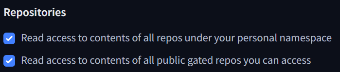

# Athora FAQ Assistant

An AI-powered FAQ assistant that answers questions about Athora’s pension products using a retrieval-augmented generation (RAG) pipeline. The system processes Athora’s product documentation, creates embeddings, stores them in a FAISS vector database, and uses an LLM to generate accurate, document-grounded answers.

# Setup Instructions
### 1. Clone the repository

```
git clone https://github.com/beatrizzamith/athora-faq.git
cd athora-faq
```

### 2. Create and activate a Conda environment
```
conda create -n athora-faq python=3.12 -y
conda activate athora-faq
```

### 3. Install dependencies
```
pip install -e .
```
This will automatically install all dependencies defined in `pyproject.toml`


### 4. Install spaCy English model
```
python -m spacy download en_core_web_sm
```


### 5. (Optional) Enable GPU acceleration

If you have an NVIDIA GPU, you can use it to speed up embedding generation and LLM inference.

Check your CUDA version:

```
nvidia-smi
```

On the top right corner, you will see something like:
```
CUDA Version: 12.4
```

Then install the matching GPU-enabled PyTorch build — **replace cuXXX with your CUDA version**:

Example: For CUDA 12.4
```
pip install torch --index-url https://download.pytorch.org/whl/cu124
``` 
Note: If your system shows CUDA 13.0 or higher, simply install the CUDA 12.4 (cu124) build.
PyTorch is backward compatible with newer driver versions.

If you’re not sure which version to use, check PyTorch’s official installation guide: https://pytorch.org/get-started/locally/


If no GPU is available, the CPU version of PyTorch (installed by default) will be used automatically — it will simply run slower.

# Input Data
Before running the application, **make sure you create a `/data` folder in the project root and place the Athora product PDF documents inside it**.

If you want to store them elsewhere, update the `pdf_folder_path` variable in your `.env` file accordingly.


# Huging Face Token Setup
This project requires a Hugging Face access token to use the Llama 3B Instruct model.

If you don’t already have one, follow the steps below:

## 1. Create a Hugging Face Account

1. Go to https://huggingface.co/join

2. Create an account using your email or GitHub/Google credentials.

3. Verify your email (you’ll receive a confirmation link).

## 2. Request Access to Meta’s Llama 3 Model

1. Visit the model page for [Llama 3 3B Instruct](https://huggingface.co/meta-llama/Llama-3.2-3B-Instruct):

2. Make sure you’re logged in.

3. Click the “Agree and access repository” button.

4. Read and accept Meta’s license terms.

5. Once approved (might take a few minutes), you’ll see a message confirming access.

### 3. Create a Personal Access Token

Go to your Account Settings → Access Tokens: https://huggingface.co/settings/tokens

1. Click “Create new token”

2. Give it a name (e.g., athora_faq_app)

3. Check the following reading permissions:



4. Copy the generated token (e.g. `hf_A1B2c3D4e5F6g7H8i9J0`)


## 4. Add Your Token to the Project

In the project root, open your .env file and add your token to the HF_TOKEN variable:

```
HF_TOKEN=hf_XXXXXXXXXXXXXXXXXXXX
```
# Run Application

Once setup is complete, launch the Streamlit app from the project root:

```
streamlit run src/app.py
``` 

This will:

1. Load the Athora PDF documents from your configured folder.

2. Automatically chunk and embed them (if not already indexed).

3. Launch a web interface where you can ask questions about the products.

4. Open Streamlit app (usually http://localhost:8501) in your browser.